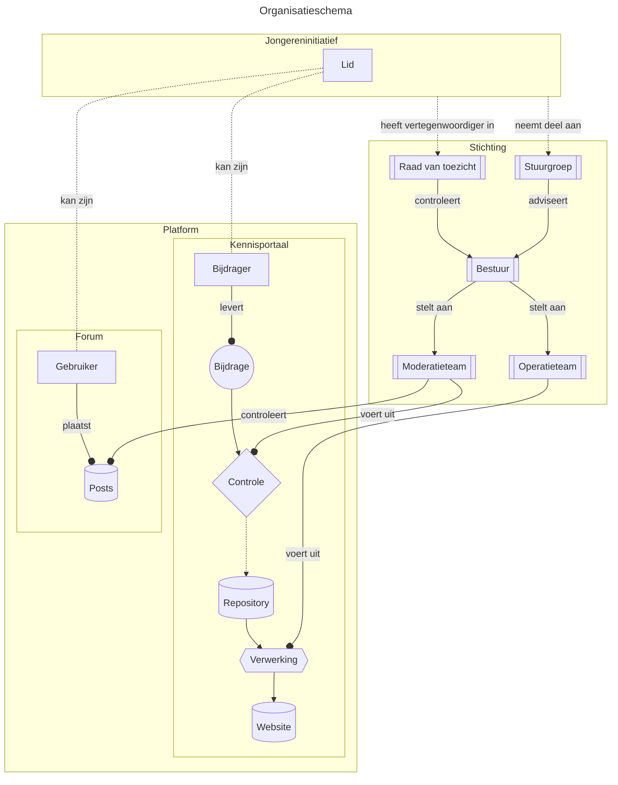

# Governance

Om de onafhankelijkheid en transparantie van het platform te waarborgen,
hebben we een governance structuur opgezet die toezicht houdt op de activiteiten
en besluitvorming van het platform.

Legaal gezien is het platform van de _Stichting voor Nederlandse Jongeren_
(name pending), een non-profit organisatie met het doel het stimuleren
van kennisdeling door en voor Nederlandse jongereninitiatieven.
De stichting is verantwoordelijk voor het beheer van het platform,
maar doet dit wel in opdracht van de community.
Daarom is de volledige governance structuur van het platform openbaar,
alsmede de keuzes die de stichting maakt.
Daarnaast zal er een stuurgroep worden opgezet,
bestaande uit vertegenwoordigers van de jongereninitiatieven,
die de stichting controleert en adviseert.

Door de keuzes van open-source software en een open governance structuur,
is het platform volledig transparant en onafhankelijk.
Daarnaast kan het platform makkelijk worden overgenomen door een andere partij,
indien de stichting niet meer in staat is om het platform
(naar behoren) te beheren.

