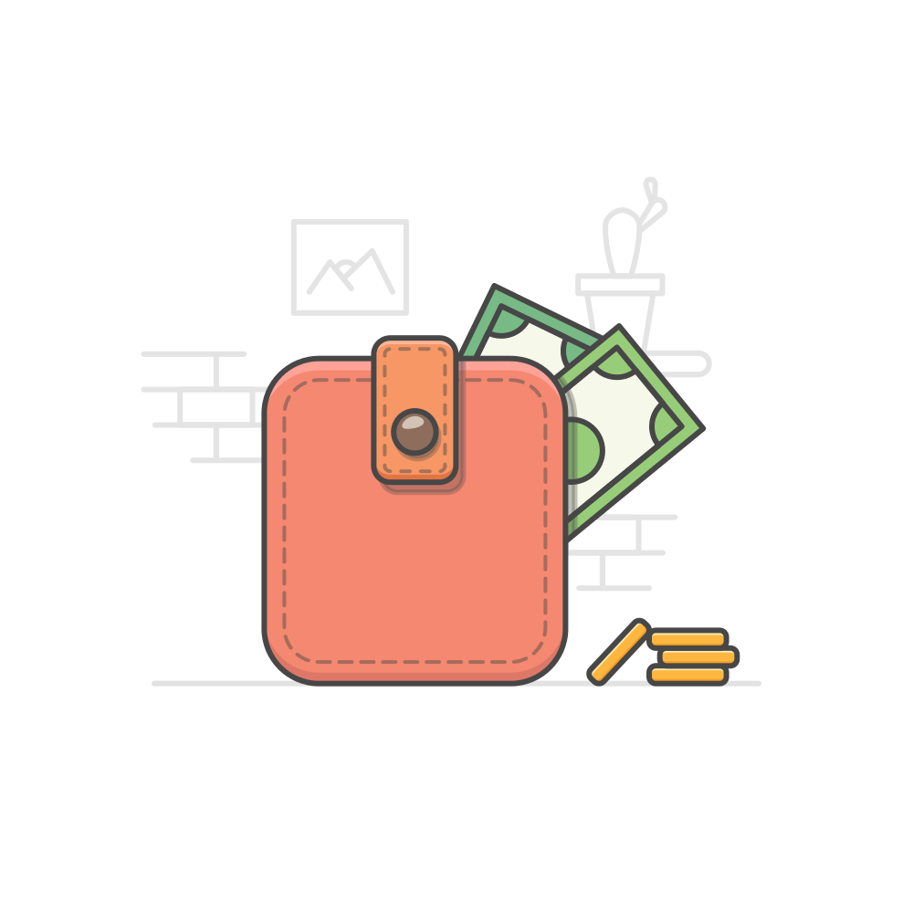
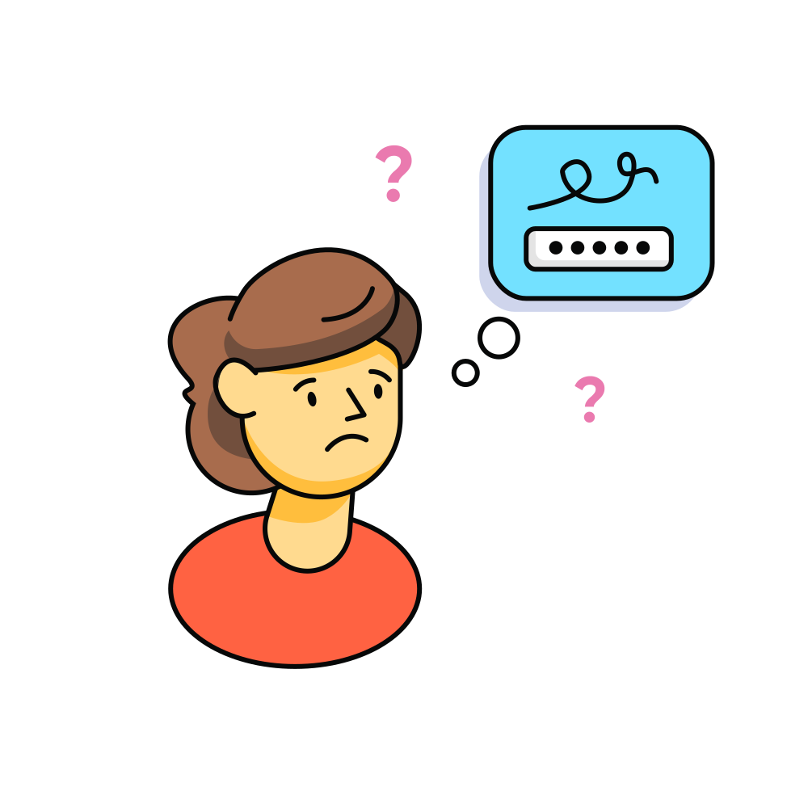
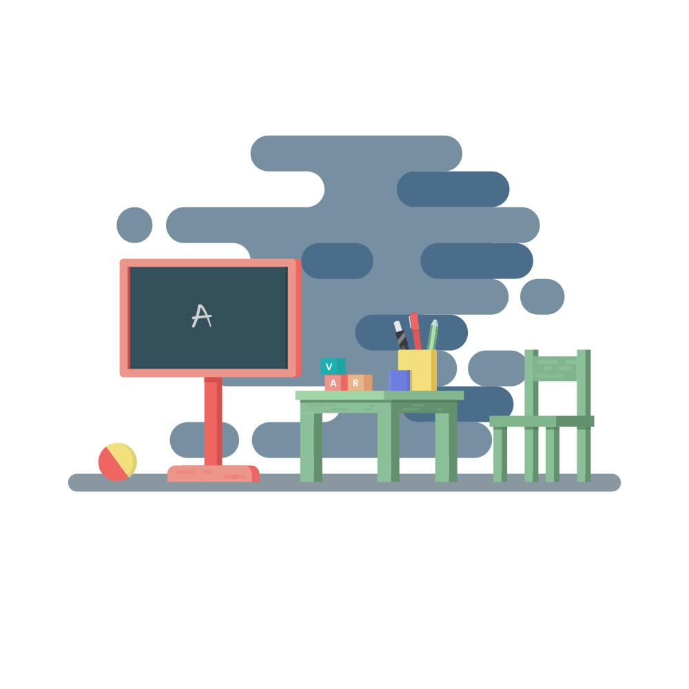
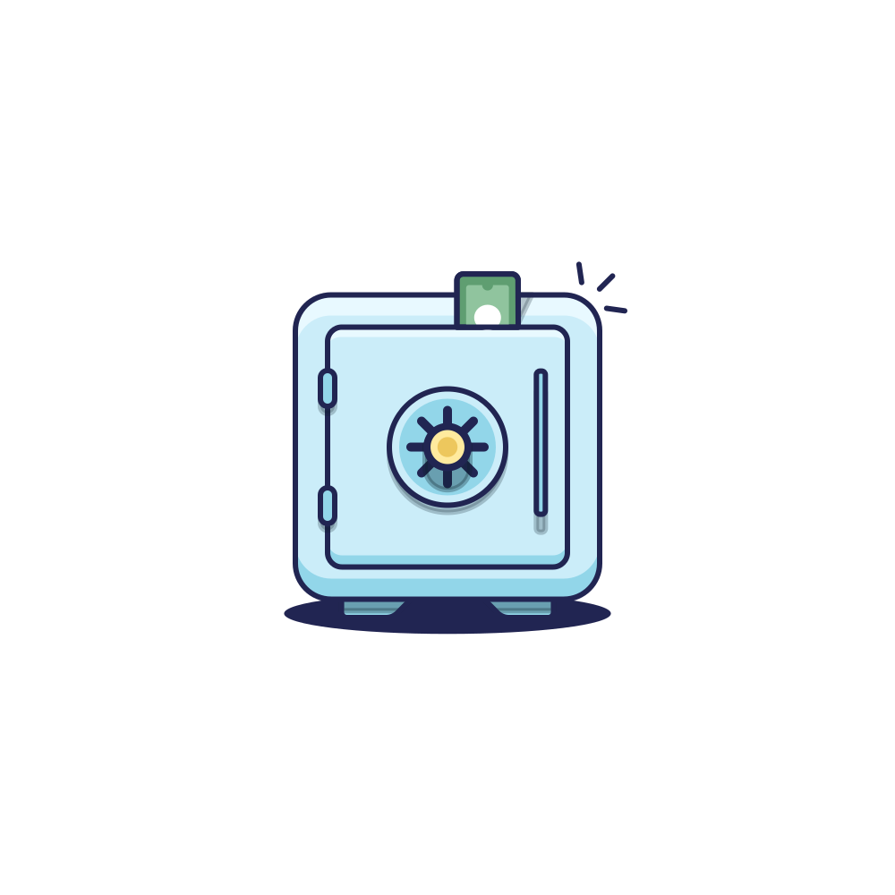

# Je krijgt een **vergoeding** vanuit je initiatief. Moet hier **belasting** over betaald worden?

Zo ja, door wie?

---

1) Ben je een vrijwilliger?
   1) Je initiatief is vrijgesteld van vennootschapsbelasting (= een vereniging of stichting zonder winst-oogmerk), of heeft een ANBI-status.
   2) Je bent niet in dienst van je initiatief (= je hebt geen contract).
   3) Je doet je werkzaamheden niet vanuit je beroep.
   4) De vergoeding is zo laag dat deze niet in verhouding staat tot de omvang en het tijdsbeslag van het werk.*
2) Is het een vergoeding voor meer dan alleen gemaakte kosten?
   * Natura geldt hierin ook als vergoeding. Diepvriespizza van de Appie bij de vergadering? € 2.49 vergoeding.

---

<!--
_paginate: hold
-->

3) Is het totaalbedrag van de vergoedingen (inclusief gemaakte kosten en natura) meer dan (a) € 3.30 per uur (< 21 jaar) of € 5.60 per uur (≥ 21 jaar)¹, (b) € 210 per maand, of (c) € 2,100 per jaar?
   * Ja: de organisatie moet inkomstenbelasting inhouden op de vergoeding en aan de belastingdienst afdragen.²
4) Krijg je vergoedingen van andere organisaties, en kom je daarmee boven de grens? (Bijvoorbeeld: reisvergoeding LC Day)
   * Ja: je moet het totaal van alle vergoedingen zelf aangeven bij de belastingaangifte.²
5) Nee? Dan hoeft er geen belasting te worden betaald.

<!--
_footer: |
 ¹ Tenzij je initiatief kan uitleggen waarom een hogere vergoeding alsnog niet-marktconform is.
 ² Als je initiatief een ANBI is, kan je ook afzien van de vergoeding en dit als gift laten aftrekken.
-->

---

<!--
_class: lead
_paginate: false
-->

# Hoe kunnen we dit soort informatie beter delen? Met een …

---

<!--
_class: lead
_paginate: skip
-->

# <!--fit--> Kennisplatform!

---

# Hoe gaat dit eruit zien?

0) Toegang krijgen
1) Informatie **vergaren**
2) Informatie **delen**
3) Informatie **opslaan**
4) Informatie **gebruiken**
5) Informatie **bespreken**

---

## 0. Toegang krijgen

* We beginnen met een besloten platform
* Later kunnen we kijken naar het (gedeeltelijk) openstellen van het platform
* Je gaat een persoonlijk account kunnen aanvragen bij je regiocoördinator

---

## 1. Informatie **vergaren**

* Hoe zet je een initiatief op?
* Waar moet je op letten als je een evenement organiseert?
* Hoe krijg je jongeren aan de formatietafel?
* Hoe voer je impactvolle campagne als jongere?
* Hoe zorg je dat beleidsmakers naar je luisteren?

---

<!--
_class: lead
_paginate: hold
-->

* ### Waar zou **jij** meer over willen weten?

* ### Waar heb **jij** veel kennis van?

---

## 2. Informatie **delen**

* Toegankelijk
  * ingewikkelde informatie ≠ ingewikkeld informeren
* Inhoudsgericht
  * het hoeft geen volledig weten&shy;schappelijke dissertatie te zijn
* Maar toch betrouwbaar?
  * → feedback!

---

<!--
_class: lead
_paginate: hold
-->

* ### Hoe zou **jij** informatie willen delen?

  Ervaringen, tips, templates, …

* ### Hou zou jij feedback willen **geven én ontvangen**?

---

## 3. Informatie **opslaan**

* Website waar informatie:
  * vindbaar is
  * geordend is
  * altijd toegankelijk is

---

## 4. Informatie **gebruiken**

---

## 5. Informatie **bespreken**

---

# En nu?

* Ik ga de komende maanden het platform bouwen
* Op de LC Day van 1 november lanceren we het platform
* Dan begint een pilot van 4 maanden waarin we kijken wat wel en niet werkt, wat we missen en kunnen verbeteren
  * Wil je meedoen aan de pilot? Laat het alvast weten!
* Na de pilot brengen we benodigde aanpassingen aan
* Op de LC Day van voorjaar 2026 is het platform klaar om door iedereen gebruikt te worden!

---

<!--
_class: lead
-->

# Vragen?

<!--
_footer: "Tekeningen © Vijay Verma"
--->
