

<!--
[verzoek om de Claper te joinen]
-->

---

# Je krijgt een **vergoeding** vanuit je initiatief. Moet hier **belasting** over betaald worden?

Zo ja, door wie?

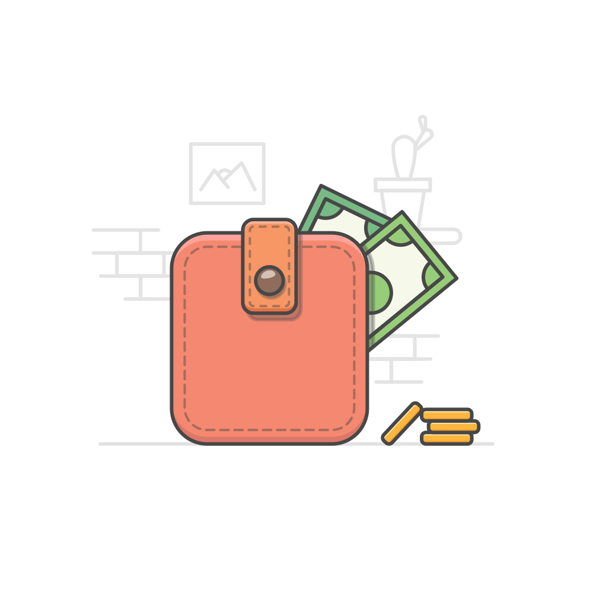

<!--
Goedenmiddag allemaal, laat me beginnen met een vraag:

Als je een vergoeding krijgt vanuit je initiatief, moet daar dan belasting (zoals inkomstenbelasting) over betaald worden? En zo ja, moet je dat dan zelf aangeven bij de belastingaangifte, moet de organisatie dat direct doen als ze het uitbetalen, of moet dat op een andere manier?

[INTERACTIEF] open vraag
-->

---

<!--
_paginate: hold
-->

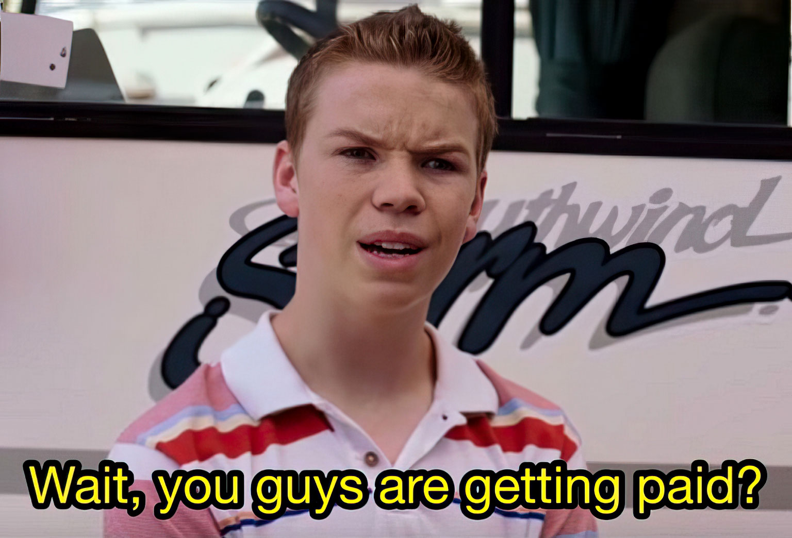

<!--
Oké, enigszins een strikvraag, het antwoord is namelijk afhankelijk van een paar zaken.
-->

---

1) Ben je een vrijwilliger?
   1) initiatief is een ANBI of vrijgesteld van vennootschapsbelasting
   2) niet in dienst van je initiatief
   3) werkzaamheden doe je niet vanuit je beroep
   4) vergoeding staat niet in verhouding tot de omvang van het werk¹
2) Is het een vergoeding voor meer dan alleen gemaakte kosten?
3) Is het totaalbedrag van de vergoedingen (inclusief gemaakte kosten en natura) meer dan (a) € 3.30 per uur (< 21 jaar) of € 5.60 per uur (≥ 21 jaar)¹, (b) € 210 per maand, of (c) € 2,100 per jaar?
4) Krijg je vergoedingen van andere organisaties, en kom je daarmee boven de grens? (Bijvoorbeeld: reisvergoeding LC Day)

<!--
Natura (vergoeding in diensten of producten) geldt hierin ook als vergoeding.

Diepvriespizza van de Appie bij de vergadering? € 2.49 vergoeding.
-->

---

<!--
_paginate: hold
-->

* 'Nee' op 1 → de organisatie moet inkomstenbelasting inhouden op de vergoeding en aan de belastingdienst afdragen
* 'Nee' op 2, 3 & 4 → geen belasting
* 'Ja' op 3 → de organisatie moet inkomstenbelasting inhouden op de vergoeding en aan de belastingdienst afdragen²
* 'Ja' op 4 → je moet het totaal van alle vergoedingen zelf aangeven bij de belastingaangifte²

<!--
_footer: |
 ¹ Tenzij je initiatief kan uitleggen waarom een hogere vergoeding alsnog niet-marktconform is.
 ² Als je initiatief een ANBI is, kan je ook afzien van de vergoeding en dit als gift laten aftrekken.
-->

---

# Wat is het punt?

* 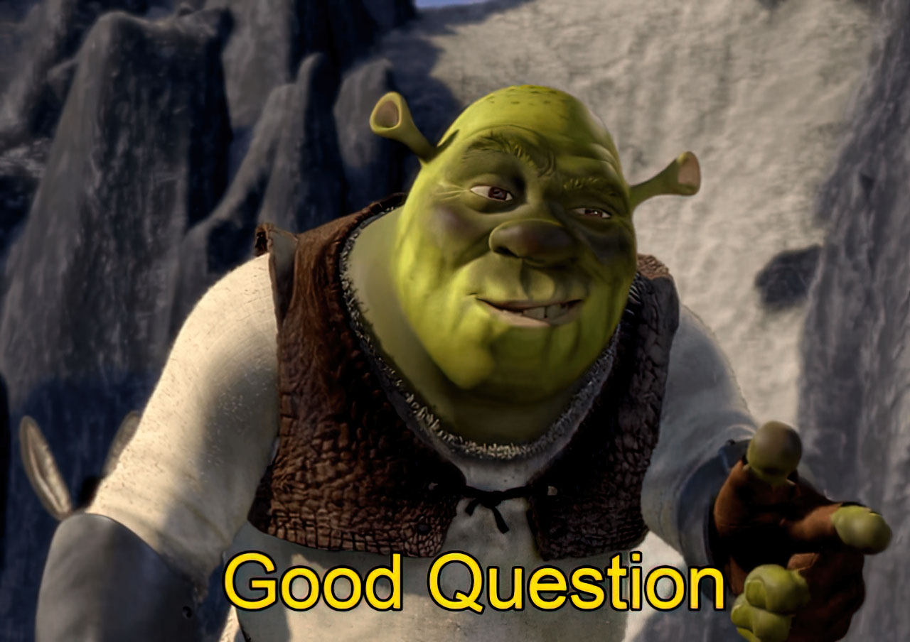

<!--
En nu denk je misschien, leuk allemaal, maar

1) als ik zo bij de borrel zit ben ik het hele verhaal weer vergeten, en
2) wat heeft dit met wat dan ook te maken?
-->

---

<!--
_paginate: hold
-->

# Wat is het punt?

* Kennis en ervaring is versnipperd
* \+ Jongereninitiatieven hebben een vrij korte doorlooptijd
* ∴ Waardevolle kennis gaat verloren
* & Iedereen bouwt zijn eigen wielen

---

<!--
_paginate: hold
-->

# Wat is het punt?

- Kennis en ervaring is versnipperd
- \+ Jongereninitiatieven hebben een vrij korte doorlooptijd
- ∴ Waardevolle kennis gaat verloren
- & Iedereen bouwt zijn eigen wielen

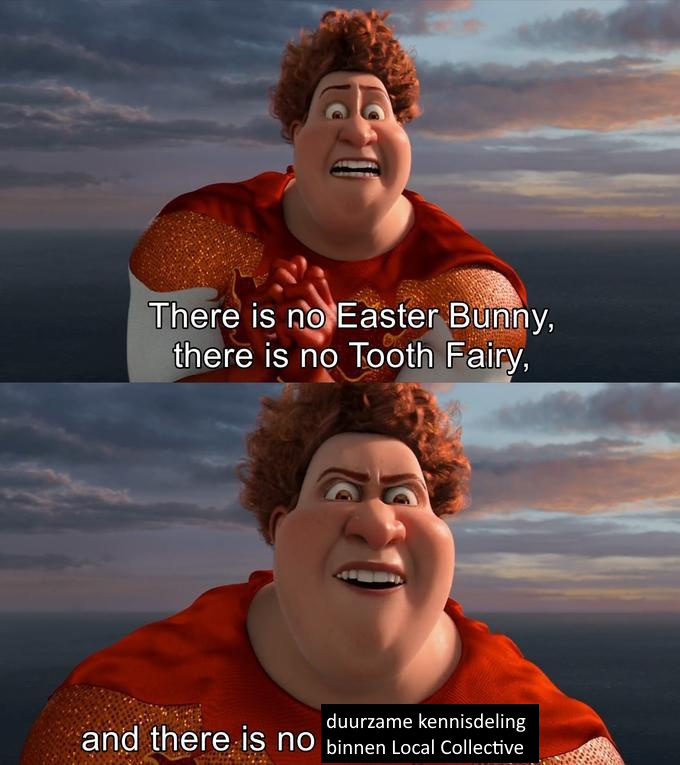

---

<!--
_class: lead
_paginate: false
-->

* ## Hoe kunnen we kennis verzamelen, behouden en met elkaar delen?

* ## Met een …

* # <!--fit--> Kennisplatform!

---

# In den beginne …

* De wens bestaat al langer …
* … maar technisch is het een uitdaging
* Enter: ik!
  <!--
  Kort over mezelf: ik ben Luka
  -->
  * Voorzitter Jongerenraad Zutphen (2021 - einde der tijden)
  <!--
  maar in het dagelijks leven
  -->
  * Technical Computer Science @ Universiteit Twente, specialisatie Smart Spaces / Enterprise Architecture & IT Management
  <!--
  (oftewel: hoe kan je informatiesystemen effectief integreren met complexe bedrijfsprocessen)
  -->
  * Back-end engineer & security architect @ Fledge
* Oftewel:

---

<!--
_paginate: hold
-->

# In den beginne …

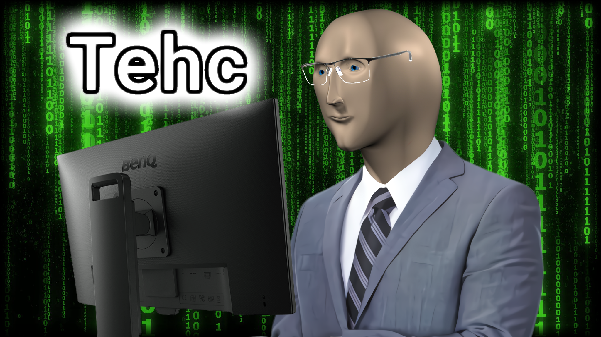

<!--
Ik bezit over de kennis en middelen om zo een platform op te zetten
-->

---

# Reisplan

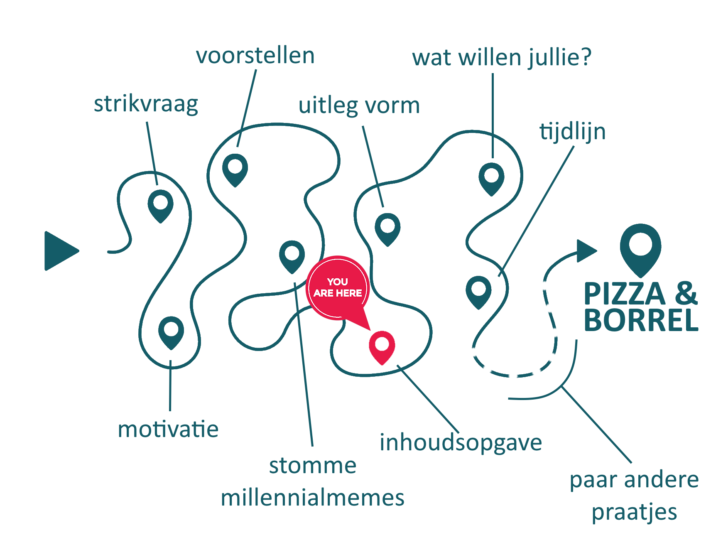

---

# Hoe gaat het eruit zien?

0) Toegang krijgen
1) Informatie **vergaren**
2) Informatie **delen**
3) Informatie **opslaan**
4) Informatie **bespreken**

---

## 0. Toegang krijgen

* We beginnen met een besloten platform
* Later kunnen we kijken naar het (gedeeltelijk) openstellen van het platform
* Je gaat een persoonlijk account kunnen aanvragen bij je regiocoördinator

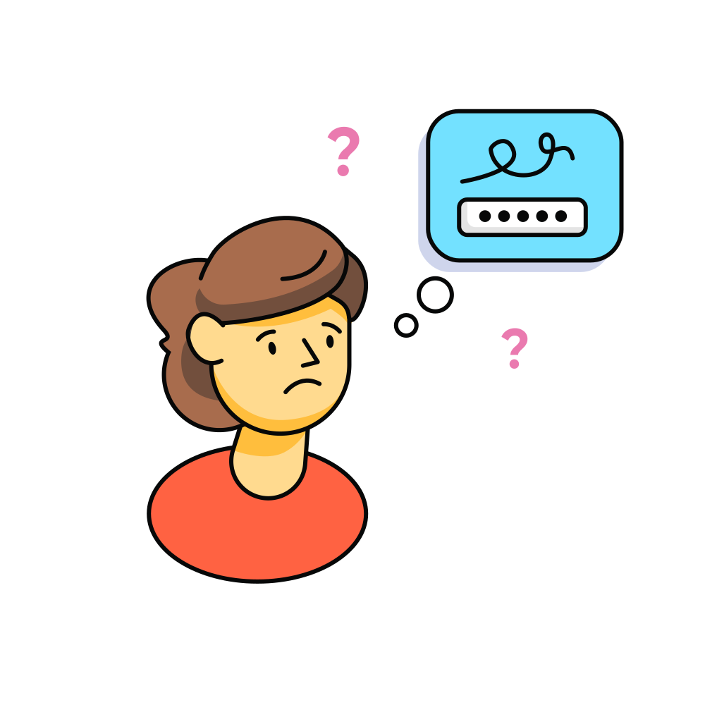

---

<!--
_paginate: hold
-->

## 0. Toegang krijgen

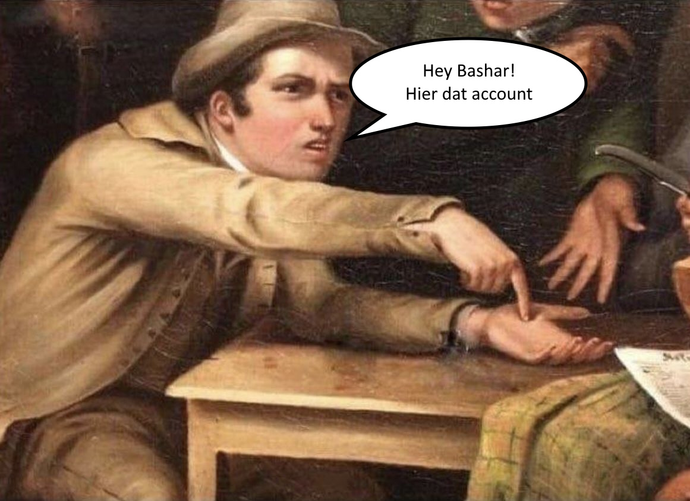

---

## 1. Informatie **vergaren**

* Hoe zet je een initiatief op?
* Waar moet je op letten als je een evenement organiseert?
* Hoe krijg je jongeren aan de formatietafel?
* Hoe voer je impactvolle campagne als jongere?
* Hoe zorg je dat beleidsmakers naar je luisteren?

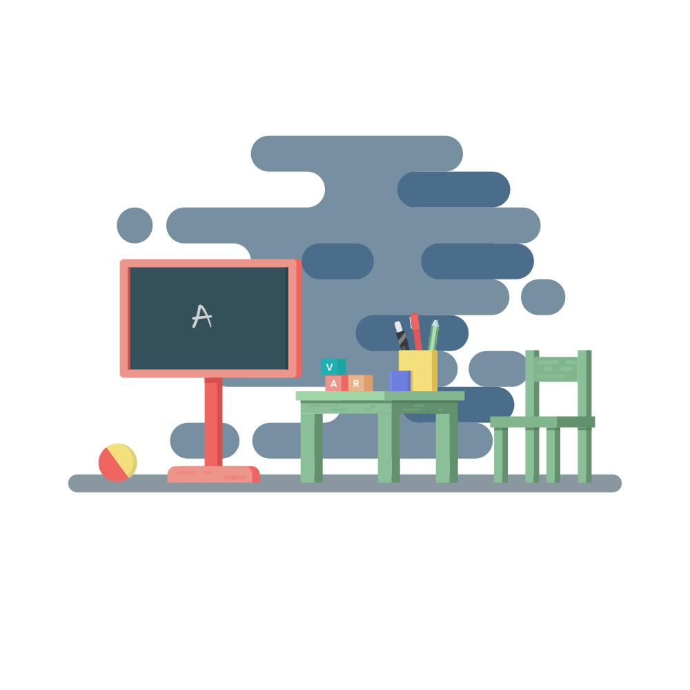

---

<!--
_class: lead
_paginate: hold
-->

* ### Waar zou **jij** meer over willen weten?

  <!--
  [INTERACTIEF] open vraag
  -->

* ### Waar heb **jij** veel kennis van?

  <!--
  [INTERACTIEF] open vraag
  -->

---

## 2. Informatie **delen**

* Toegankelijk
  * ingewikkelde informatie ≠ ingewikkeld informeren
* Inhoudsgericht
  * het hoeft geen volledig weten&shy;schappelijke dissertatie te zijn
* Maar toch betrouwbaar?
  * → feedback!

---

<!--
_class: lead
_paginate: hold
-->

* ### Hoe zou **jij** informatie willen delen?

  Ervaringen, tips, templates, …

  <!--
  [INTERACTIEF] open vraag
  -->

* ### Hou zou jij feedback willen **geven én ontvangen**?

  <!--
  [INTERACTIEF] multiple choice
  - commentaar onderaan de pagina
  - persoonlijke berichten
  - like/dislike-systeem
  - peer review
  -->

---

## 3. Informatie **opslaan**

* Controle op
  * juistheid
  * taalgebruik
  * neutraliteit
* Website waar informatie
  * vindbaar is
  * geordend is
  * altijd toegankelijk is

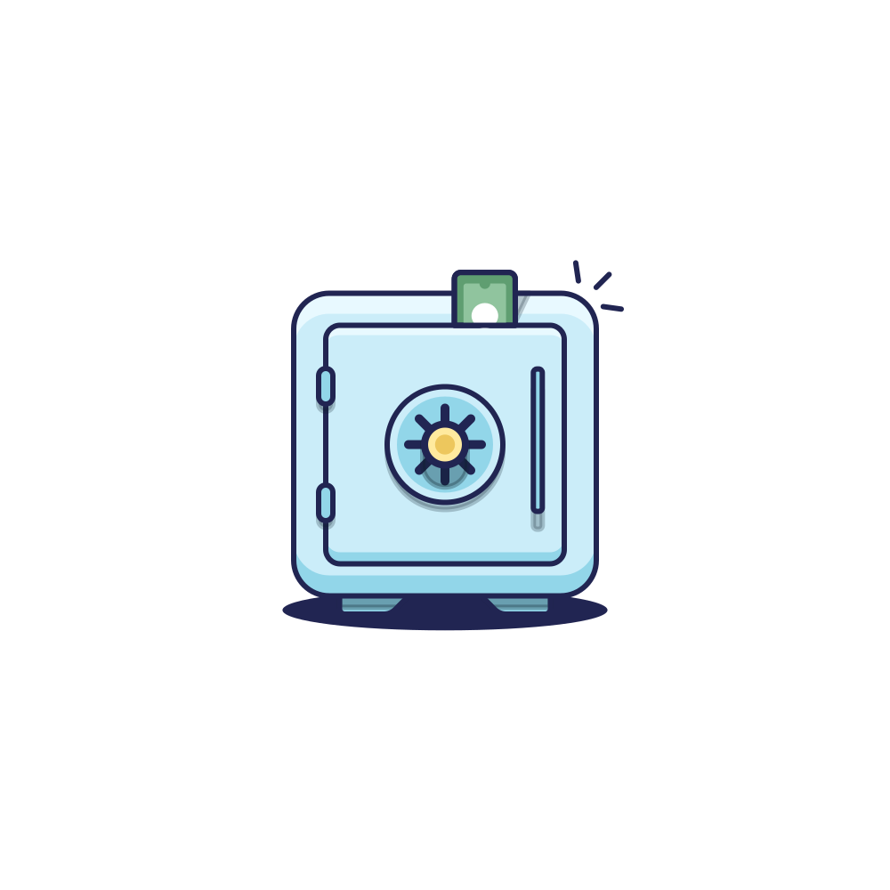

---

## 4. Informatie **bespreken**

* Wil je meer details weten?
* Mis je bepaalde info?
* Klopt iets niet (meer)?
* Benieuwd hoe anderen hetzelfde hebben gedaan?
* Informatie kan altijd verbeterd worden!

---

# Tijdlijn

* Komende maanden: ik bouw het platform
* 1 november (LC Day!): begin pilot
* november - februari: pilot
  * wat werkt wel en wat niet
  * feedback verzamelen
  * wat missen we?
* maart - april: aanpassingen aanbrengen
* LC Day voorjaar 2026: lancering voor iedereen!

---

# Wat kan je nu al doen?

* Denk na over:
  * wat wil je weten
  * wat kun je delen
  * of je mee wil/kan doen aan de pilot (2-4 uur / week)
* Tip van flip: kijk in je eigen initiatief ook eens hoe (en of!) informatie wordt overgedragen

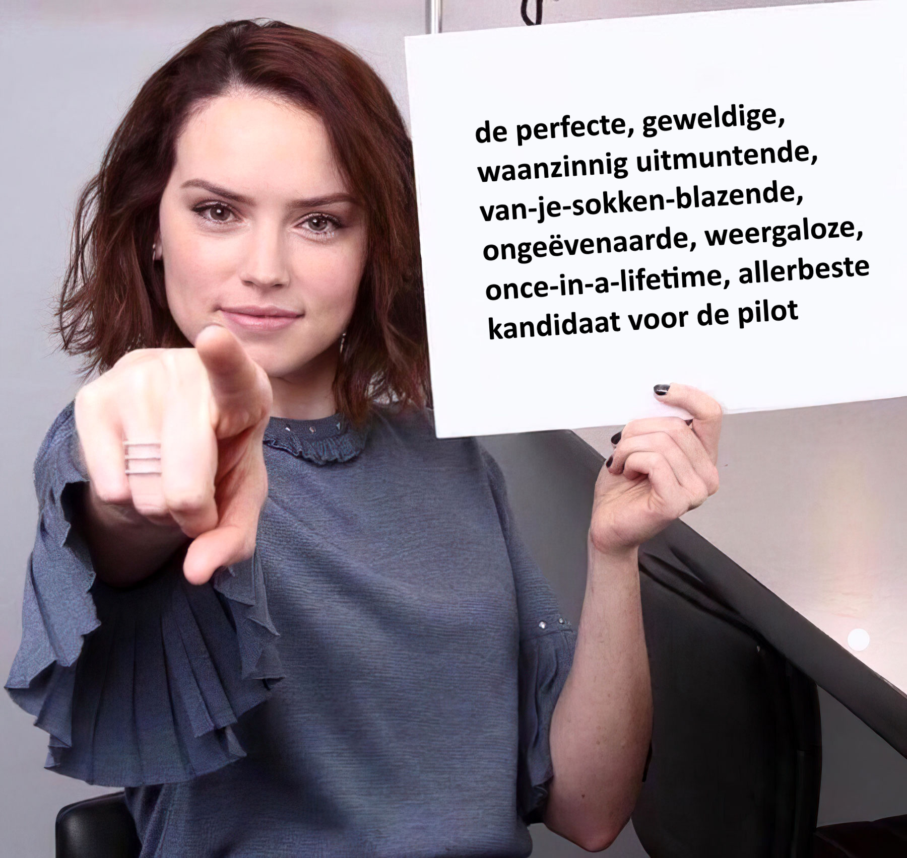

---

<!--
_class: lead
-->

# Vragen?

of is de informatie perfect … _overgedragen_

<!--
_footer: "Tekeningen © Vijay Verma | Memes © internet en ikzelf"
--->

---

<!--
_class: lead
_paginate: hold
-->

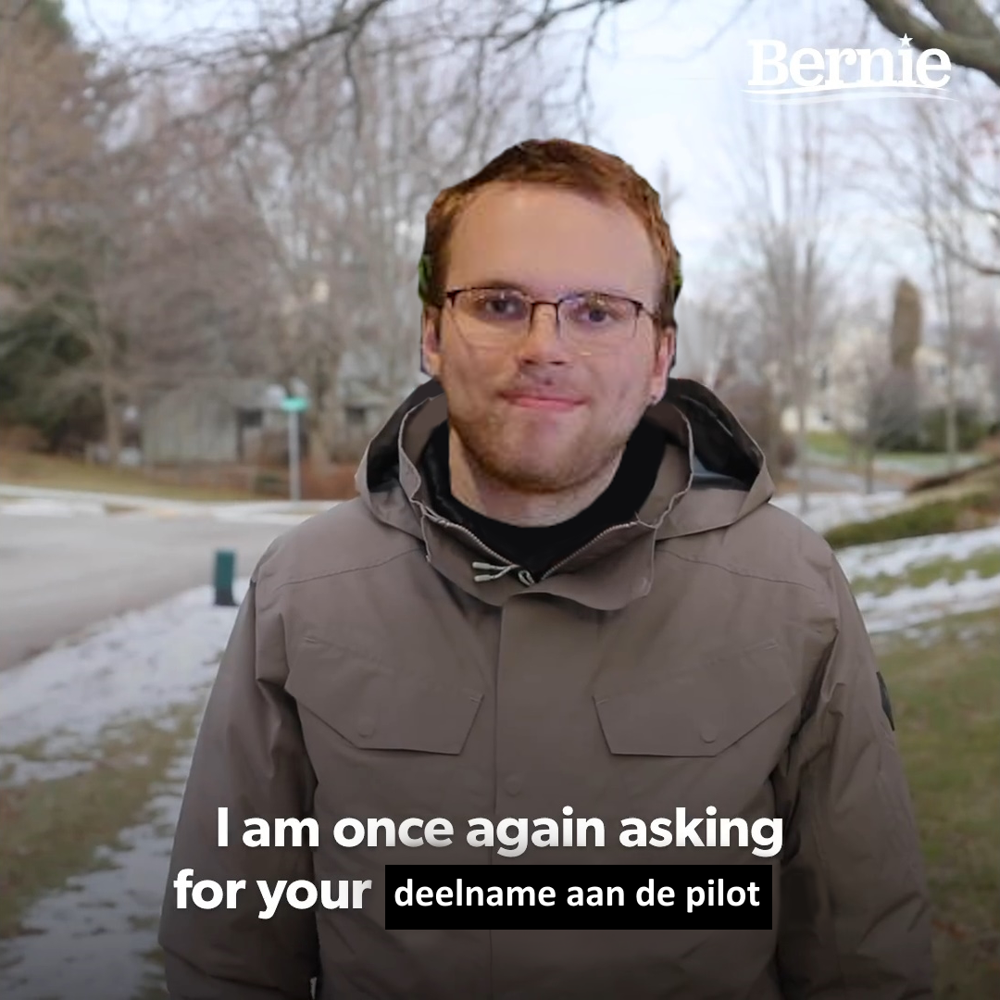

<!--
_footer: "Tekeningen © Vijay Verma | Memes © internet en ikzelf"
--->
